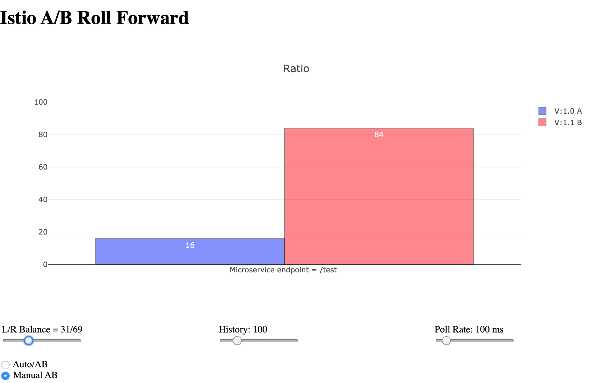

This is a simple iter8 example.





To install 

```
source install.sh 
```

This will set the environment variables needed. 

It installs a simple demo app which fetches an endpoint "/test"  on localhost.
If you want a different host that localhost, edit the virtual service in abapp for the hostname.
This is useful if you want multiple services exposed at different endpoints with different routes.

The /test endpoint is implemented by two versions of the microservice. These are demoservice-v1, demoservice-v2.

The default balance 50/50 betwween them. The UI will show which response is which.
As this is a demo based on https://github.com/jduimovich/kdemo-all, to show iter8, it has disabled the sliders and the only way to interact is using the toggle. script. 

The `toggle.sh` script will alternate from v1 to v2 and back.

```
sh toggle.sh 
```

Run `show-experiment.sh` script to track the movement from a to b.

```
sh show-experiment.sh 
```
This will show the status of the progressing experiment in a loop.

```
NAME            PHASE       STATUS                                       BASELINE         PERCENTAGE  CANDIDATE   PERCENTAGE
id-0214103423   Completed   ExperimentSucceeded: AllSuccessCriteriaMet   demoservice-v2   0           demoservice-v1   100
```

The demo app is installed at http://localhost/ui unless you changed the host name.


